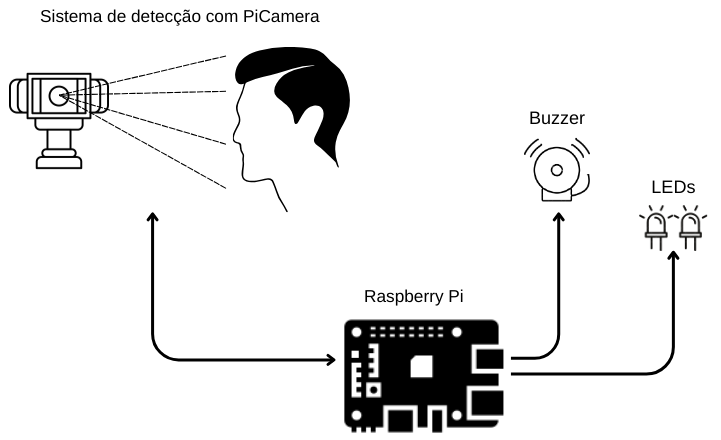
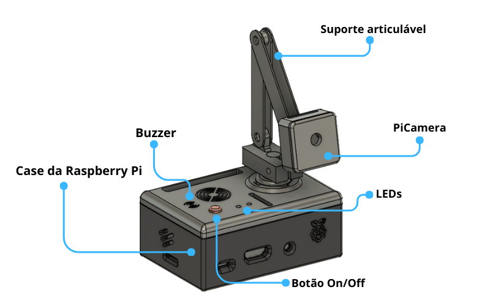

# Detecção de sonolência ao volante 🚗💤

Este projeto, desenvolvido como parte do Trabalho de Conclusão do Curso de Engenharia de Computação, tem como objetivo o desenvolvimento de um protótipo utilizando Raspberry Pi e técnicas de Visão Computacional para detectar o fechamento dos olhos do motorista, indicando possível sonolência, e emitir um alerta sonoro como medida preventiva.

## 🧑‍💻 Sobre o projeto 

### **Funcionamento** ⚙️🧠

Utilizando o framework MediaPipe, o sistema realiza a detecção de pontos ao redor dos olhos e calcula a distância entre eles. Com base nessa informação, é emitido um sinal sonoro por meio de um buzzer para alertar o usuário. Além disso, dois LEDs indicadores são utilizados para auxiliar o usuário no posicionamento correto da câmera.

Diagrama do sistema

### **Tecnologias utilizadas** 💡

- MediaPipe
- Python
- Raspberry PI 3b

## 📋Requisitos 

- Raspberry PI com sistema `32 Bits` instalado;
- Bibliotecas e pacotes instalados:
    - `Python`
    - `OpenCV`
    - `MediaPipe`
    - `Picamera2`

## ✔️Protótipo desenvolvido

## 🧪Experimento

Clique [aqui](https://youtu.be/U2tNWzFKFI8) para visualizar o experimento realizado

## ⏳️Em desenvolvimento... 

Com o intuito de aprimorar o sistema, está sendo desenvolvida a implementação de uma Rede Neural Convolucional para detectar outros sinais de sonolência, como o bocejo, por exemplo.

Em breve, novas atualizações estarão disponíveis...🚀